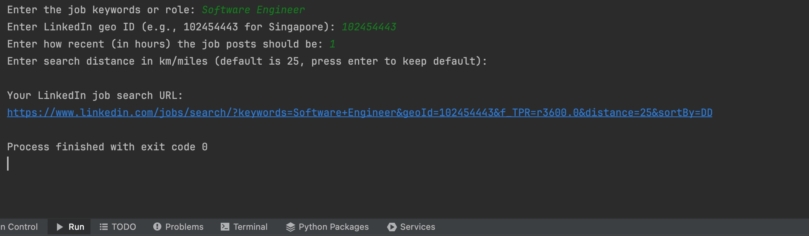

# LinkedIn Job URL Generator (Python Script) 🔗

This Python script helps generate LinkedIn job search URLs based on your specified criteria, making it easier to find recent job postings in your desired location.

## 🚀 Features

- Quickly generate LinkedIn URLs to filter jobs posted within recent hours.
- Customize search keywords, geographic location (using LinkedIn GeoID), and search radius.

## ⚙️ Requirements

- Python 3.x

## 📥 Installation

Clone this repository:

```bash
git clone https://github.com/your-username/linkedin-url-generator.git
cd linkedin-url-generator
```

## ▶️ Usage

Run the script:

```bash
python main.py
```

You'll be prompted to enter:
- **Keywords** for the job (e.g., "Sales Director").
- **LinkedIn Geo ID** (e.g., 102454443 for Singapore).
- **Hours** (how recent the jobs should be).
- **Distance** (search radius, default is 25).

### Example output:

```
Your LinkedIn job search URL:
https://www.linkedin.com/jobs/search/?keywords=Sales+Director&geoId=102454443&f_TPR=r21600&distance=25&sortBy=DD
```

## 🌎 LinkedIn Geo IDs (Examples)

Common LinkedIn Geo IDs:

| Location      | Geo ID      |
|---------------|-------------|
| Singapore     | `102454443` |
| India         | `102713980` |
| United States | `103644278` |
| Australia     | `101452733` |
| United Kingdom| `101165590` |

*You can find additional LinkedIn Geo IDs by inspecting the URL on the LinkedIn jobs search page.*

## 📸 Screenshot




## 📄 License

This project is open-source and available under the [MIT License](LICENSE).
